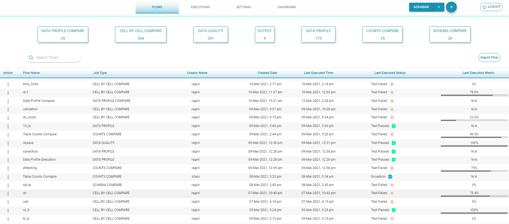
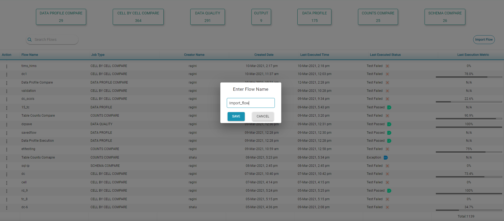
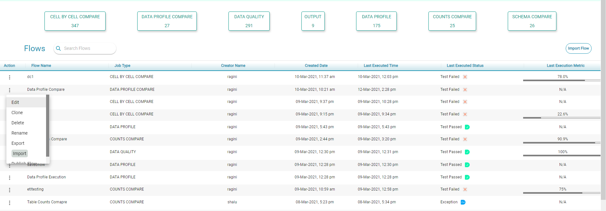
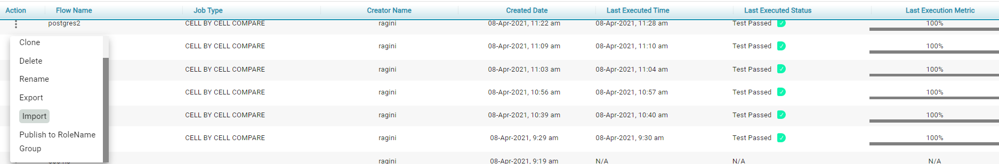
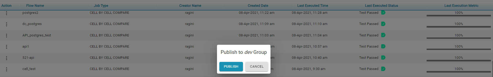

# Flows

The _Flows _page displays all the user-saved and executed flows.

Some important features of this page are:

* **Search: **Allows users to search in the displayed flows for a specific flow by _Flow Name_, _Job Type_, _Creator Name_, _Created Date_, _Last Executed Time,_ or _Last Executed Status._
* **Import Flow: **This feature permits users to upload a JSON file with information to create a flow. To do this, follow these instructions:
  * Click on the _Import Flow_ button which is located above the table, to the right. 
  * Find and select the JSON file to be imported from your documents.
  * Click on _Save_ to import the flow under the flows table.
  * Click on _Cancel_ to stop the import process.
  * A message is displayed to inform the user that the flow has been successfully imported. 
* The flows' list can be sorted by clicking on the columns' titles, i.e., _Flow Name, Job Type, Creator Name, Created Date, Last Executed Time,_ and _Last Executed Status._

Each flow under the _Action_ column has seven available actions, which can be accessed by clicking on the three-dots icon next to the check box. These actions are:  

       **1. Edit**  - By clicking on this action the system redirects the user to the edit canvas of this particular flow, and can then modify it. 

**   2. Clone - **By clicking on this action a user can duplicate the corresponding flow:

* Select the _Clone_ option.
* Provide the flow's name. 
* Click on _Save_ to clone the flow.       

**   3. Delete - **This action allows the user to delete the selected flow.

**   4. Rename - **This action is used to rename the selected flow. To rename a flow:  

* Select the_ Rename_ option. 
* Modify the flow's Name.
* Click on S_ave_ to rename the flow.

**   5. Export - **This action can be used to download selected flow as a JSON file.

**   6. Publish - **This action is used to share the selected flow to all the users in that group. A flow belongs only to the user that created it until the user has published the flow. To publish a flow:

* Select a flow to publish. 
* Click on_ Save_ to publish the flow.

