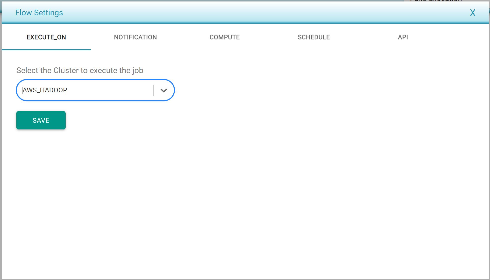

# Defining Flow Settings

* Flow settings can be defined in a per-flow basis.
* The following are the flow settings, which can be set individually or when a batch of flows is to be executed. Users can access these settings by clicking on the three-slider bar icon on the top-right of the screen, next to the _Result_ button.
  * **Execute_ON** is a setting used to specify where this flow will be executed. 
    * A list of server cluster managers is provided in the dropdown menu, and it can be set to an AWS environment, Databricks, or on the local server. 
    * The number of threads and memory to be allocated to this execution can also be set here. 
    * In the box under the text _Number of flows to execute in parallel_, a user can set how many flows are to be executed in parallel. If more flows have been selected for execution than those allowed in this box, the remaining flows will be executed as soon as the first batch of parallel-run flows has been completed. 

* **Notification** is a setting that can be used to receive an email notification when the test case is completed with the result of the test case. This tab allows users to set the email destination for the notification. Note that more than one email can be set. 

****

