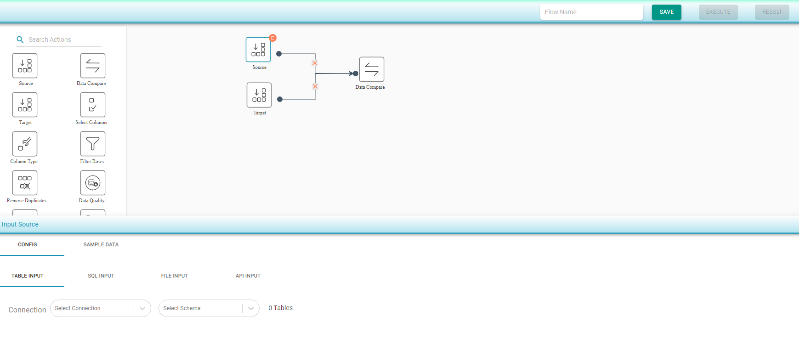

# Data Compare

### Compare two data sources (Tables/SQL/files/API output)

The _Data Compare_ shape can be used to compare the following four options of two or more data sources/targets:

* **ETL Testing/Cell by Cell Compare** : Compares every cell from the configured source with the corresponding cell of the configured target. 
* **Table Counts Compare** : Compares the counts of source and target tables. 
* **Schema Compare** : Compares the schema of source and target. 
* **Data Profile Compare** : Compares the data profile of the source and target.
* **Data Migration Validation** : Compares same type of schema.

To create a new compare flow:

* Drag a _Source_ component from the palette to the canvas and configure it as explained in the _Define Data Source and Target_ section. 
* Drag a _Target _component from the palette to the canvas and configure it as explained in the _Define Data Source and Target_ section.
* Drag a _Data Compare_ component from the palette to the canvas. Join the connections by clicking on the dark circles next to each component and dragging your pointer to the other component's circle.  

\
