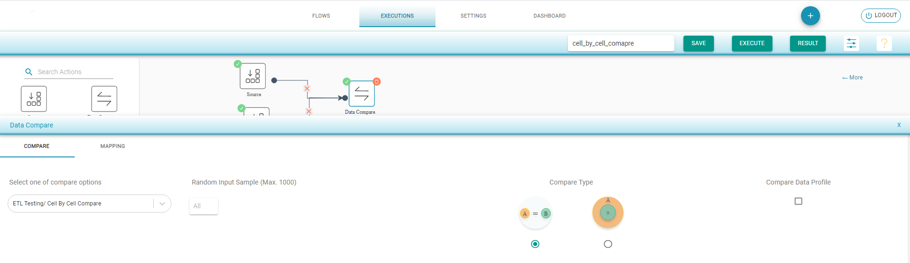
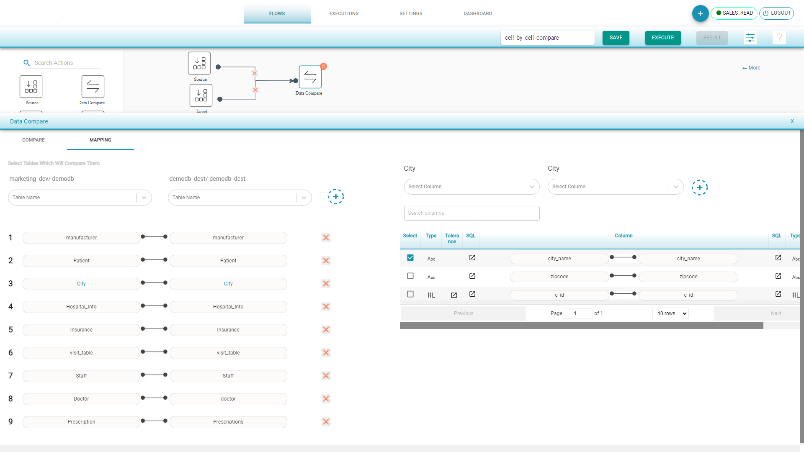
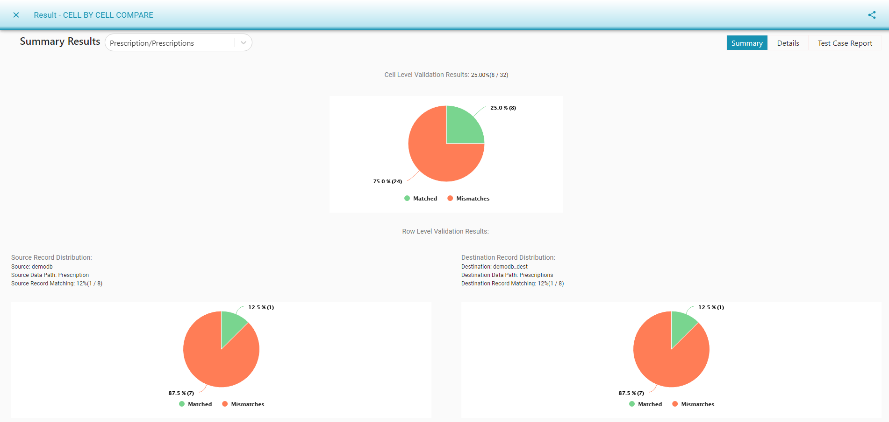
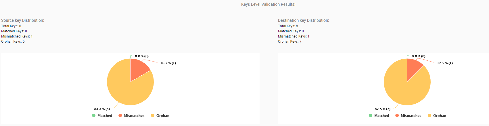

# ETL Testing/Cell By Cell Compare

This compare option will compare the data, or columns, of the source and target tables on various checks.

To create a _Cell By Cell Compare_ flow:

* Drag a _Source_ component from the palette to the canvas.
* Choose the _Input Source Configuration_ and select the tables to compare.
* Drag a _Target _component from the palette to the canvas.
* Choose the _Input Source Configuration_ and select the tables to compare 
* Drag a _Data Compare_ component and join the connections. 
* Select _ETL Testing/Cell By Cell Comparison_ from the drop-down menu that appears at the bottom of the screen.
* Select the primary key. By default, the primary key is selected for the tables. If the key is not selected, the system shows a warning sign for the user to select the _Primary Key_.
* Save and execute the flow.

[Data Compare Options](https://app.gitbook.com/@dataq/s/docs/flows/untitled-1/compare-cell-by-cell/cell-by-cell-compare/sql-transformation)

TestingWhizPro can compare the selected source and destination tables to view:

* _Cell Level Validation Results._
* _Source and Destination Record Matching. _
* _Source and Destination key Distributions._

.png>)

