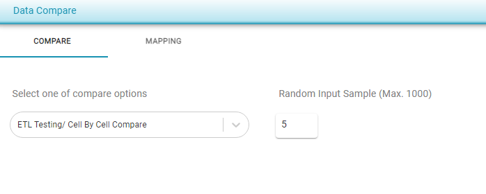

# Data Compare Options

These are some of the options present in the configuration page for _ETL Testing/Cell by Cell Compare._

* **Random Input Sample** : User can provide a number of sample records for comparison, which allows a maximum of 1000 records.
  * Type in the number of records to be compared under _Random Input Sample._

* **Compare Type** **: **This option allows the user to chose the type of comparison being made. The first option requires that both source and target have the same amount of records for the test to be regarded as passed, whereas the second option allows for _A_ to have more records than _B_ and still pass the test. 

****

* **Compare Data Profile** : This allows the user to compare the selected tables in both                            [Cell By Cell Compare](https://app.gitbook.com/@dataq/s/docs/\~/drafts/-MWNZNqGnn1zbZL4vVWr/flows/untitled-1/compare-cell-by-cell/cell-by-cell-compare) and [Data Profile Compare](https://app.gitbook.com/@dataq/s/docs/\~/drafts/-MWNZNqGnn1zbZL4vVWr/flows/untitled-1/compare-cell-by-cell/data-profile-compare). This means that TestingWhizPro will generate statistical information for each of the columns of the selected tables, such as average, standard deviation, minimum, maximum, etc., for both _Source_ and _Target_, and it will compare the data profiles.
  * Check the _Compare Data Profile_ checkbox to compare the data profile of the source and target.      

 

.png>)

