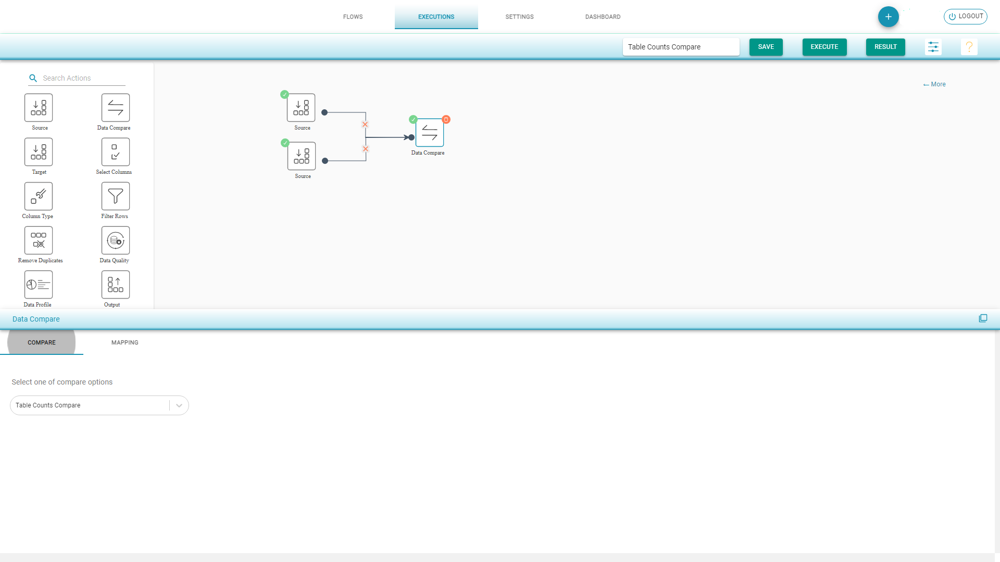

# Table Counts Compare

This comparison type compares the total source and destination total count of column records.

**Table Counts Compare Flow**

* Drag a _Source_ component from the palette to the canvas.
* Choose the _Input Source Configuration_ and select the tables for table counts compare.
* Drag a _Target _component from the palette to the canvas.
* Choose the _Input Source Configuration_ and select the tables for table counts compare. 
* Drag a _Data Compare_ component and join the connections. 
* Select _Table Counts Comparison_ from the drop-down menu that appears at the bottom of the screen.
* In the _Mapping_ tab, the tables with the same name are auto mapped. You can manually map the other tables and the corresponding columns. 
* Save and execute the flow.

.png>)

****

**Table Counts Compare Result **

* _Summary_ shows the percentage of matched and mismatched table counts.
* _Details _shows _Source_ and _Target_ count of matched and mismatched tables count.

.png>)

.png>)


There is an option to the top right corner to** **share the link for this flow, and send it to other team members to examine the results.


.png>)
