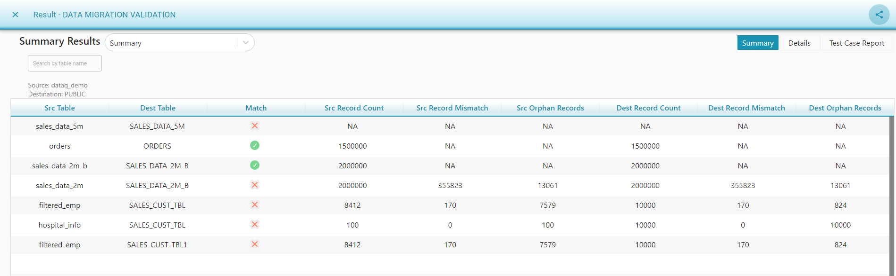

# Data Migration Validation

This comparison option is used to compare the same type of schema.

**Data Migration Validation Flow **

* Drag a _Source_ component from the palette to the canvas.
* Choose the _Input Source Configuration_ and select the tables for _Data Migration Validation_.
* Drag a _Target _component from the palette to the canvas.
* Choose the _Input Source Configuration_ and select the tables for _Data Migration Validation_. 
* Drag a _Data Compare_ component and join the connections. 
* Select _Data Migration Validation_ from the drop-down menu that appears at the bottom of the screen.
* In the _Mapping_ tab, the tables with the same name are auto mapped. You can manually map the other tables and the corresponding columns. 
  * If the column type differs, the system will show a red icon with the following message to the user _"Schema should be same for data migration compare"_  beside the table mapping. 
  * Remove the column/table if different type of columns are mapped.
  * Data types should be the same for _Data Migration validation_.
* Save and execute the flow.

We can compare the selected source and destination tables to view 

* _Source and Destination Record Distribution._
* _Source and Destination Data Mismatches._
* Success/failure results of each mapped column are shown in _Test Case Report_.

.png>)

