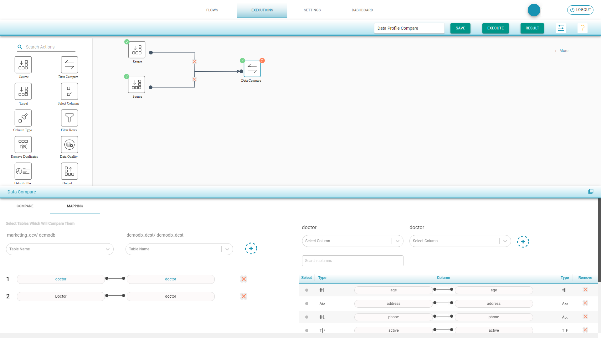

# Data Profile Compare

This compare option compares the _Data Profiles_ of the _Source_ and _Target_ tables.

**Data Profile Compare Flow**

* Drag a _Source_ component from the palette to the canvas.
* Choose the _Input Source Configuration_ and select the tables for data profile compare.
* Drag a _Target _component from the palette to the canvas.
* Choose the _Input Source Configuration_ and select the tables for data profile compare. 
* Drag a _Data Compare_ component and join the connections. 
* Select _Data Profile Compare_ from the drop-down menu that appears at the bottom of the screen.
* In the _Mapping_ tab, the tables with the same name are auto mapped. You can manually map the other tables and the corresponding columns. 
* Save and execute the flow.

.png>)

**Data Profile Compare Result**

* Select the table from the dropdown menu to get the detailed information of the table's data.
* The columns with the same name are shown under _Common Columns._
* Click on the columns to view the detailed information of _Source_ and _Target _together.

.png>)

