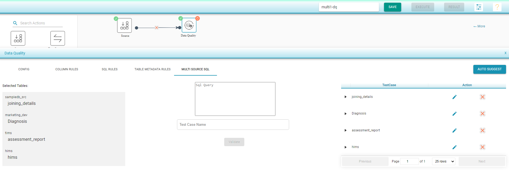

# Data Quality

The _Data Quality_ shape is used to validate, or cleanup, input data against rules which are defined by the user. There are five tabs to configure the _Data Quality_ shape:

* **Config**
  * A _Random Input Sample_ can be specified to test the data in a reduced quantity to accelerate the process. 
  * When the _Data Profile_ checkbox is checked, the flow will validate the data profile of the input data against the profile created during the flow creation.
  * The _Import Rules_ and _Export Rules_ options on this tab can be used to import or export the user-defined rules. 
* **Column rules**
  * This tab is used to define any conditions/rules at column level manually for the selected table. What follows are the different rules which can be defined at the column level:
    * _Empty check rule _: Rule to create a test case that checks if the column is empty. If the checkbox for this rule is checked, during the execution of the flow, if the corresponding column has an empty value in any row during the execution of the flow, this test case will have failed. 
    * _Null check rule _: This rule will pass during execution if the percentage for the number of not nulls in this column falls below the defined threshold.
    * _Unique check _:  This rule will pass during execution if the percentage for the number of unique values in this column falls below the defined threshold.
    * _Left/Right spaces _: _Content coming soon_
    * _Min length _: This rule will pass if all the values in the column are more than the defined minimum length.
    * _Max length _: This rule will pass if all the values in the column are less than the defined maximum length.
    * _Min value _: This rule will pass if all the values in the column are more than the defined minimum value.
    * _Max value _: This rule will pass if all the values in the column are less than the defined maximum value.
    * _SQL _: An SQL expression, or rule, can be used to check if all rows in this specific column satisfy this column's condition. If one of the rows fails to satisfy the condition, the test case will have failed.
    * _Regular expression _: This builds a test case where, in a given column, every value of the corresponding column should comply with the regular expression.
    * _Pre-built rules _: Prebuilt rules can be added to apply at the column level of each row. If any of the rows does not satisfy the condition of the prebuilt rule, the test case will have failed.


The above mentioned rules under _Column Rules_ will be auto-suggested by the system, except for SQL. Once the rules are auto-suggested,  the user can edit them to customize specific scenarios.


*   **SQL Rules** 

    * This tab can be used to define more than one test case with one custom SQL rule, creating one test case.
    * The result of the SQL rule query should return zero rows for test case pass criteria. If one or more rows are returned, the test case is considered to have failed.
    * Each SQL rule can be a complex query involving one or more tables from the source. The source can be either a table, file, or API.
    * If the source is defined as a file, then the SQL rule can contain only one table, the name of which will be a concatenation of the name of the file and its extension.
      * Note: If multiple data sources are involved in the same query, use the _MultiSQL _tab.

* **Table Metadata Rules**
  *   This tab can be used to set a series of conditions to monitor the selected tables, in case there are changes in the source data.

      * _Minimum record count _: This will define a test case that checks for a minimum record count during each input validation process, and will fail if the record count received is less than the defined threshold.
      * _Maximum record count _: This will define a test case that checks for a maximum record count during each input validation process, and will fail if the record count received is more than the defined threshold.
      * _Column name _: When this option is checked, a test case will be created which checks if the column names are changed with reference to the column names from when the original flow was created.
      * _Data types _: This option, when checked, will create a test case that will be evaluated during each execution, checking if the data types of the elements are changed. 
        * Note: This option is always available for table inputs and SQL inputs and cannot be selected if the _InferSchema _option is not selected in the file input.
      * _New columns _: This column, when checked, will create test cases to be evaluated for the presence of more columns than when the flow is created.
      * _Removed columns _: This column, when checked, will create test cases to be evaluated for the presence of fewer columns than when the flow is created.
      * _Delimiters _: This option will create a test case to check if all rows have the same number of delimiters. This option is available only for a file input with delimiters.

* **Multi Source SQL**
  * This tab is used to create an SQL rule that applies to tables that are coming from multiple, and possibly different, types of connections. These multi-connections can be any combination of:
    * SQL connections 
    * File connections 
    * API connections.
  * As with the SQL rules tab, the test case is considered as passed when the query defined in this tab does not return any results, i.e., it checks for the negation condition.
  * Any number of queries can be defined, which will in turn create a test case for each defined query.
  * After entering the _Test Case Name, _users can click on the _Validate _button to ensure the proper application of the SQL query_._
  * The validated queries are shown on the right panel and the user has an option to edit/remove the query.

