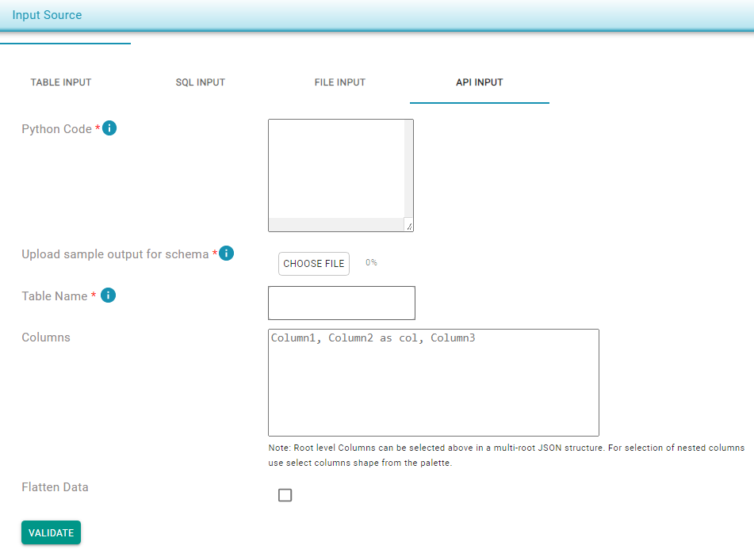

# API Input

To provide an API as data input: 

* Provide a Python script which can execute one or more APIs to get the output.
* The final API should write the output to a specific location, e.g., _**/tmp/dq\_output\_file\_name.json**_**.**
* Provide a sample output JSON for the schema.


Ensure the sample output \(few records\) represents all of the columns.


Sample Python code snippet for an API_:_

```text
import requests
import json

 
API_KEY = "d25a07df6199416b87816551ebf80b0744c50b8c2fa385909c0820cfde80a3c5"
PDL_VERSION = "v5"
PDL_URL = "https://dataops-store.s3.amazonaws.com/conversation.json"
 
 
params = {
   "api_key": API_KEY,
   "name": ["sean thorne"],
   "company": ["peopledatalabs.com"]
}
 
json_response = requests.get(PDL_URL, params=params).json()
json_text = json.dumps(json_response)
f = open("/tmp/dq_output_file_name.json", "w")
f.write(json_text)
f.close()
```







