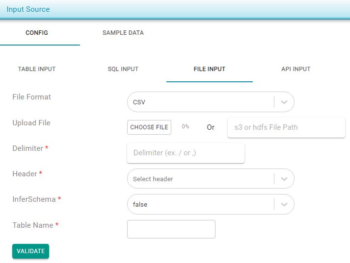

# Excel/CSV

There are two ways to provide an _Excel_ or _CSV_ file as the input files:

* Upload files \(supports both _CSV_ and _ZIP_ files\).
* Provide an _s3_ location : **s3a**://&lt;file\_path&gt;.


If you're providing an _s3_ file path, ensure that the TestingWhizPro server _IAMRole_ has permission to read from the _s3_ bucket. The file size limit for uploads is 50MB.


After selecting a file format and uploading the file:

* Provide a _Delimiter_ option if the CSV file format is selected.
* Select a _Header_ from the drop down menu. 
* Select if schema should be inferred.
  * Note : If the input file size is large &gt; 20MB, it is recommended not to select _InferSchema_ as _true_.
* Click on _Validate_. At this point, the CSV file is validated and, if successful, sample records are fetched. Check the _Sample Data_ tab to ensure the file parsing is successful and that the data is as expected.

