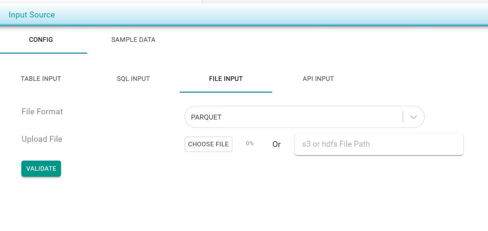

# Parquet/AVRO

Parquet or AVRO can also be used as file options for the data sources and targets. As with previous file formats, select the corresponding option for file format and choose the file location, or specify _s3_ path or _HDFS_ location.


If you're providing an _s3_ file path, ensure that the TestingWhizPro server _IAMRole_ has permission to read from the _s3_ bucket. The file size limit for uploads 50MB.


