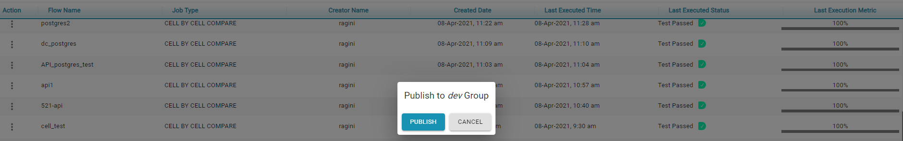

# Flows

The Flows page displays all the user saved and executed flows.

On executing a flow the count is incremented and displayed under the corresponding Comparisons

* **Search**  enables to search the flows with Flow Name, Job Type, Creator Name, Created Date,          Last Executed Time and Last Executed Status
* **Import Flow** is used to upload a JSON file
  *  Click on the Import Flow button which is placed above the table. 
  * This allows to name the imported JSON file
  *  click on Save to import the flow under the Flows table
  * Click Cancel to stop the import process 
  * A message is displayed to inform the user that the Flow is imported successfully 
* User can sort the flows by clicking on the columns Flow Name, Job Type, Creator Name, Created Date, Last Executed Time and  Last Executed Status

* Each flow under Action Column  has seven states

       **1. Edit**  - On click of Edit, system redirects the user to the particular flow and can modify the existing flow

   **2. Clone -** On click of Clone user can duplicate the flow

* Select Clone option
* Provide the Flow Name 
* Click on save to clone the flow       

   **3. Delete -** This allows the user to delete the selected flow

   **4. Rename -** This is used to rename the selected flow  

* Select Rename option 
* Modify the Flow Name
* Click on save to rename the flow

   **5. Export -** The selected flow can be downloaded as a file

   **6. Import -** This is used to import an existing flow either saved or executed.

   **7. Publish -** This is used to share the selected flow to all the users in that group

* Select a flow to Publish 
* Click on Save to publish the flow

