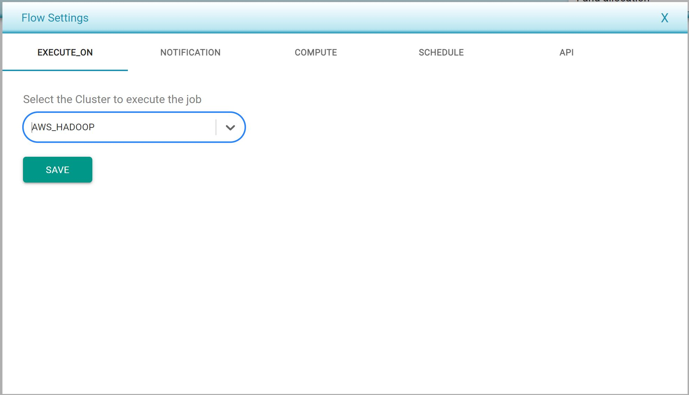

# Defining flow settings

* Flow settings can be defined per flow.
* Following are the flow settings which can be set at flow level
  * Execute on is the setting to specify where to execute this flow. List of server cluster managers are provided in the drop and it can on predefined AWS environment or Databricks or on local server.

* 
