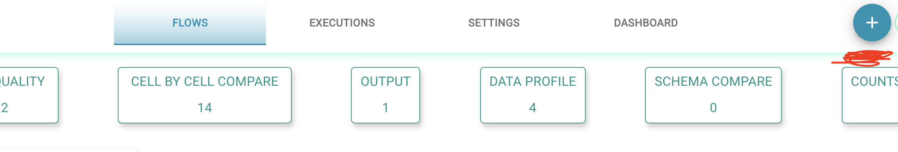
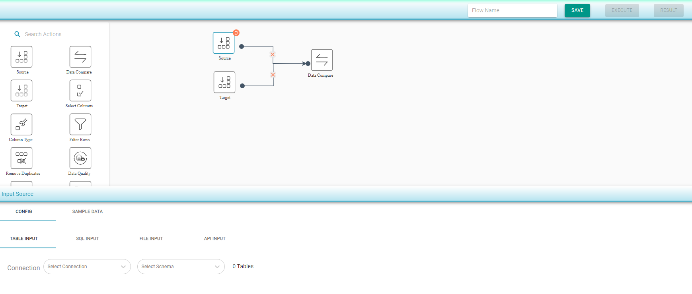

# Data Reconciliation/Compare

### To compare two data sources \(tables/sql/files/API ouput\)

### This shape can be used to compare the following four options

* **Cell by cell compare** : Compares every cell from configured source with the corresponding cell of the target. 
* **Counts compare** : Compares the counts of source and target tables. 
* **Schema compare** : Compare the schema of source and target. 
* **Data Profile compare** : Compares the data profile of the source and target.
* **Data Migration Validation** : Compares same type of Schema

To Create a new Flow , click on Create Flow " + "  icon which is placed at the top right 

* Drag Source component to the canvas
* Drag Target component to the canvas
* Drag Data Compare component to the canvas and join the connections

  

