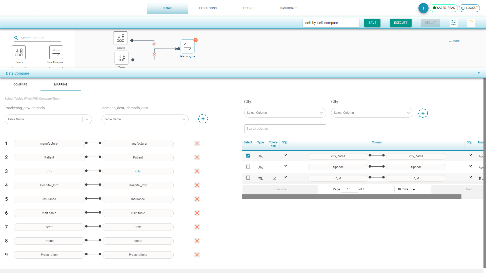

# Cell By Cell Compare

Compares the data or columns of source and destination tables on various checks.

**Cell By Cell Compare Flow**

* Drag Source component from left to the canvas
* Choose the Input Source Configuration and select the tables to compare
* Drag Target component from left to the canvas 
* Choose the Input Source Configuration and select the tables to compare 
* Drag Data Compare component and join the connections 
* Select ETL Testing/Cell By Cell Comparison 
* In Mapping tab, the tables with same name are auto mapped. Map the other tables and the corresponding columns. Select the primary key.
* By default the primary key is selected for the tables. If the key is not selected, system shows a warning sign for the user to select the Primary Key.
* Save and Execute the flow

[Data Compare Options](https://app.gitbook.com/@TestingWhizPro/s/docs/flows/untitled-1/compare-cell-by-cell/cell-by-cell-compare/sql-transformation)

We can compare the selected source and destination tables to view

* Cell Level Validation Results
* Source and Destination Record Matching 
* Source and Destination key Distribution

