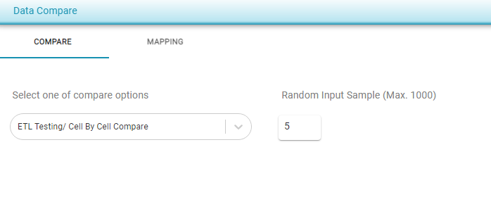
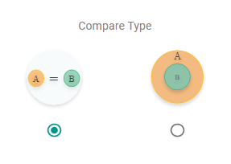
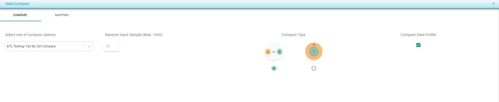

# Data Compare Options

* **Random Input Sample** : User can provide no. of sample records for Comparison and it allows maximum of 1000 records
  * Select no. of records to be compared under Random Input Sample

* **Compare Type** **:** TO DO

\*\*\*\*

* **Compare Data Profile** : This allows the user to compare the selected tables in both                            [Cell By Cell Compare](https://app.gitbook.com/@TestingWhizPro/s/docs/~/drafts/-MWNZNqGnn1zbZL4vVWr/flows/untitled-1/compare-cell-by-cell/cell-by-cell-compare) and [Data Profile Compare](https://app.gitbook.com/@TestingWhizPro/s/docs/~/drafts/-MWNZNqGnn1zbZL4vVWr/flows/untitled-1/compare-cell-by-cell/data-profile-compare)
* Mark Compare Data Profile checkbox to compare the data profile of the source and target.      

 

