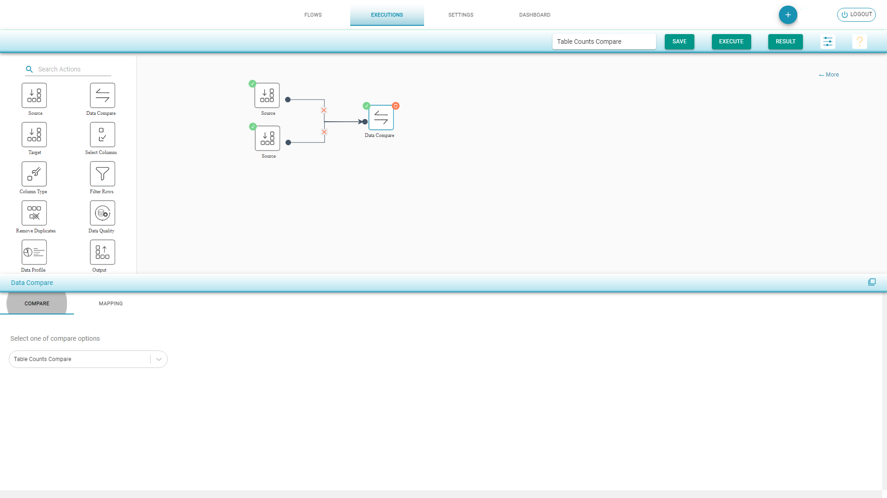

# Counts Compare

Compares the total source and destination columns record count.

**Table Counts Compare Flow**

* Drag Source component from left to the canvas
* Choose Input Source Configuration and select the tables for Counts compare 
* Drag Target component from left to the canvas
* Choose Input Source Configuration and select the tables for Counts compare
* Drag Data Compare component and join the connections
* Select Table Counts Comparison 
* In Mapping tab, the tables with same name are auto mapped. Map the other tables to compare table counts 
* Save and Execute the flow

\*\*\*\*

**Table Counts Compare Result** 

* Summary shows the percentage of matched and mismatched counts 
* Details shows Source and Destination tables matched and mismatched count

There is an option to the top right corner to ****Share the link and send to other team to examine the results

