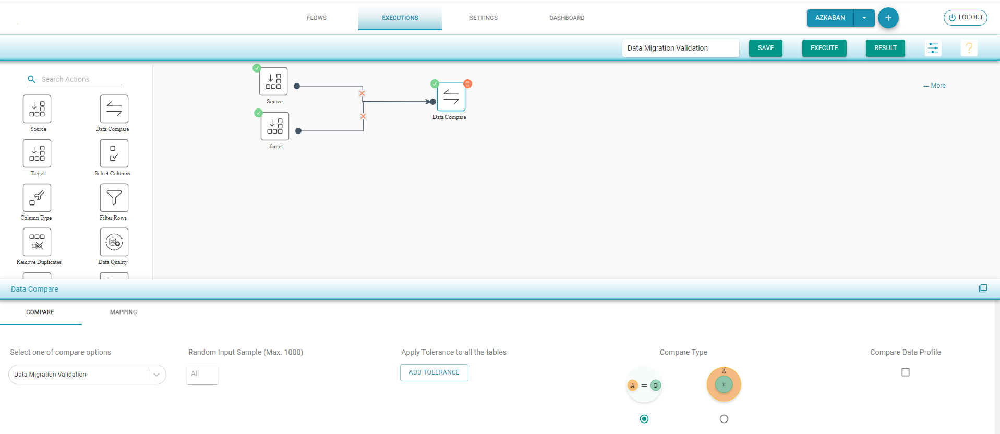
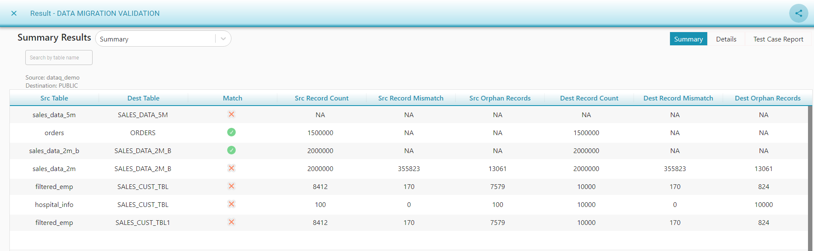
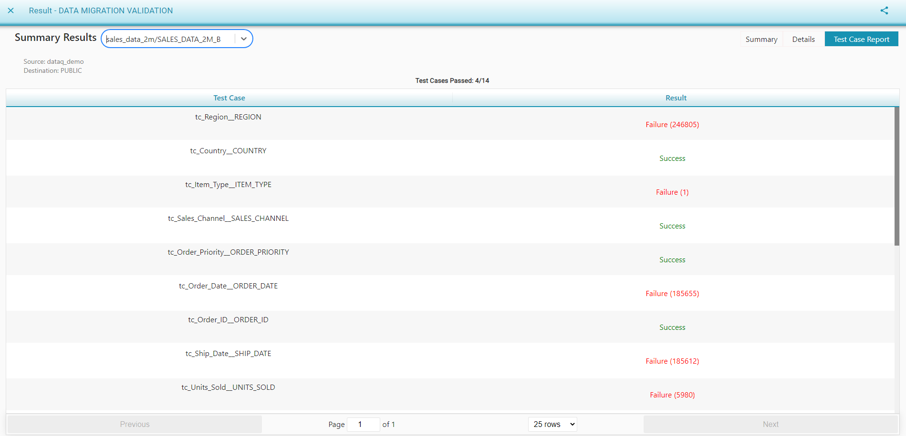

# Data Migration Validation

Data Migration Validation is used to compare same type of Schema

**Data Migration Validation Flow** 

* Drag Source component from left to the canvas. 
* Drag Target component from left to the canvas. 
* Choose Input Source Configuration and select the tables for Data Profile Compare 
* Drag Data Compare component and join the connections
* Select Data Migration Validation 
* In Mapping tab, the tables with same name are auto mapped.                                                                Map the other tables and corresponding columns with same type. 
  * If the column type differs then system shows the red icon with a message to the user as "Schema should be same for data migration compare"  beside the table mapping.                                            Remove the column/table if different type of column is mapped
  * Data Types should be same for “Data Migration“ validation.
* Save and Execute the flow

We can compare the selected source and destination tables to view 

* Source and Destination Record Distribution 
* Source and Destination Data Mismatches 
* Success/Failure Result of each mapped column is shown in Test Case Report

