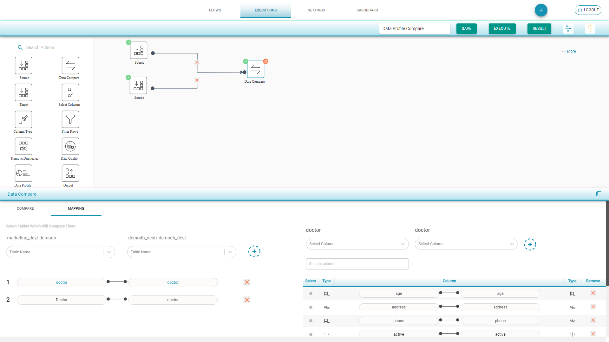

# Data Profile Compare

Compare the Data Profiles of the Source and Target tables.

Data Profile Compare Flow

* Drag Source component from left to the canvas
* Choose Input Source Configuration and select the tables for Data Profile Compare
* After adding the tables check the Sample data of the selected tables 
* Drag Target component from left to the canvas
* Choose Input Source Configuration and select the tables for Data Profile Compare
* Drag Data Compare component and join the connections 
* Select Data Profile Compare 
* In Mapping tab, the tables with same name are auto mapped. 

  Map the other tables and corresponding columns to do Data Profile compare 

* Save and Execute the flow

**Data Profile Compare Result**

* Select the table from the dropdown to get the detailed information of the tables data
* The columns with same name are shown under Common Columns
* Click on the Columns to view the detailed information of Source and Destination together

