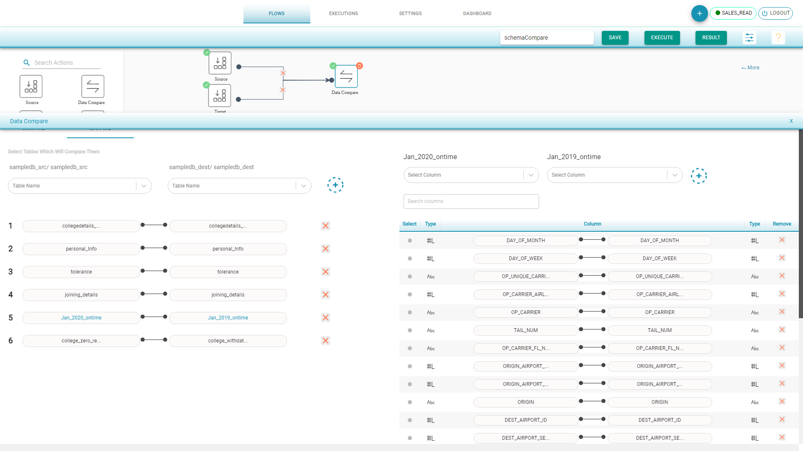

# Schema Compare

Compares the table schema or we can say compares the columns with their data types.

If data types don't match then its a failure.

**Schema Compare Flow** 

* Drag Source component from left to the canvas
* Choose the Input Source Configuration and select the tables for Schema compare 
* Drag Target component from left to the canvas. 
* Choose the Input Source Configuration and select the tables for Schema compare 
* Drag Data Compare component and join the connections
* Select Schema Comparison
* In Mapping tab, the tables with same name are auto mapped. Map the tables and columns to compare the schema 
* Save and Execute the flow

**Schema Compare Result** shows

**Summary** presents the number of tables matched/mismatched count and the total columns matched/mismatched count

**Details**  arranges the total tables matched and mismatched information based on the Column Data Type

