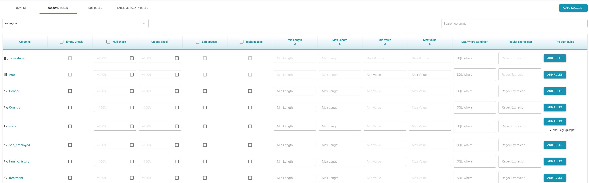

# Data Quality

* Data quality shape is used to validate input data against the rules which are defined.
* There are four tabs to configure Data quality shape.
  * Config
    * Data profile check box when enabled will validate the data profile of the input data against the profile which is created during the flow creation.
    * Import rules and export rules options on this tab can be used to import or export the rules which are defined. 
  * Column rules
    * This tab is used to define any conditions/rules at the column level manually. Following are the different rules which can be defined at the column level
      * Empty check rule : Rule to create a test case which checks for if the column is empty. If the check box for this rule is checked,  during execution of the flow if the corresponding column has empty value in any row, this test case will be failed. 
      * Null check rule : This rule will pass during execution if the percentage of number of not nulls in this column falls below the defined threshold.
      * Unique check :  This rule will pass during execution if the percentage of number of unique values in this column falls below the defined threshold.
      * Left/Right spaces :
      * Min length: This rule will pass if all the values in the column are more than the defined minimum length.
      * Max length: This rule will pass if all the values in the column are less than maximum length.
      * Min value: This rule will pass if all the values in the column are more than the defined minimum value.
      * Max value: This rule will pass if all the values in the column are less than defined maximum value.
      * SQL where condition : A sql expression can be used to check if all rows satisfy this column condition. Even if one of the row fails to satisfy the condition then the test case is failed.
      * Regular expression : This builds a test case when given on a column, every value of the corresponding column should comply with the regular expression.
      * Prebuilt rules : Prebuilt rules can be added to apply at column level of each row. If any of the row does not satisfy the condition of the prebuilt rule, the test case will be failed.

* Auto Suggest : The above mentioned rules under Column rules will be auto suggested by the system except for SQL where condition and regular expression. Once the rules are auto suggested, user can edit them to customize specific scenarios.
* SQL rules : 
  * This tab can be used to define more than one test case with one SQL rule creating one test case.
  * The result of SQL rule query should return zero rows for test case pass criteria. If one or more rows are returned, the test case is considered to be failed.
  * Each SQL rule can be complex query involving one or more tables on the source  if the input is database.
  * If the source is defined as a file, then the SQL rule can contain only one table, the name of which will be concatenation of name of the file and its extension.
* Table Metadata rules
  * Minimum record count: This will define a test case which will check for minimum record count during each input validation process and will fail if the record count received is less than the defined threshold.
  * Maximum record count : This will define a test case which will check for maximum record count during each input validation process and will fail if the record count received is more than the defined threshold.
  * Column name : When this option is checked, this will create a test case to check for if the column names are changed with reference to column names when the original flow is created.
  * Data types : This option when checked will create a test case and will be evaluated during each execution if the datatypes of the elements are changed. 
    * Note : This option is always available for Table input and SQL input and cannot be selected if the Infer schema option is not selected in the file input.
  * New columns : This column when checked will create test cases to be evaluated for the presence of more  columns than when the flow is created.
  * Removed columns : This column when checked will create test cases to be evaluated for the presence of less number of columns than when the flow is created.
  * Delimiters : This option will create a test case to check if all rows have same number of delimiters and this option is available only for file input with delimiters.

