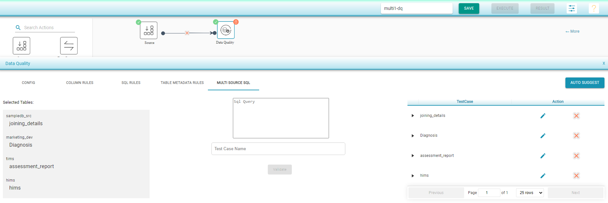

# Multi Source SQL

* This tab is used to create test cases based on sources from multiple connections. The multi connections can be any combination of SQL connections and or file connections and/or API connections.
* As with SQL rules tab, the test case is considered as passed when the query defined in this tab does not return any results i.e it checks for negation condition.
* Any number of queries can be defined which will in turn create a test case for each defined query.

To select one or more Input Sources :

* Click on any of the Input Source
* Select the Connection and corresponding Database
* Select the tables 
* Click on Add Selected
* Select another Input Source and repeat the above steps
* Drag Data Quality and join the connections
* Select Data Quality component and click on Multi source SQL
* User can enter sql queries on the selected Tables 
* Enter the Test Case Name and click on Validate
* The validated queries are shown in the right panel and user has an option to edit/remove the query
* Save and Execute the flow 

 

