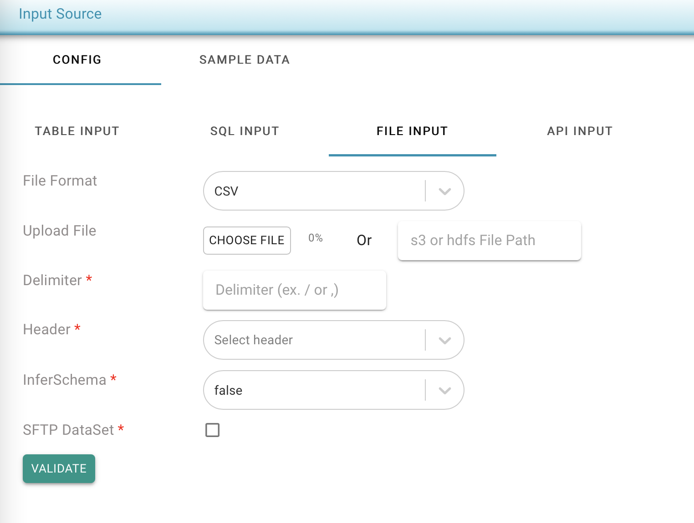

# Excel/CSV

There are two ways to provide the input files

* Upload files \(supports both csv and zip files\)
* provide s3 location : **s3a**://&lt;file\_path&gt;


If providing S3 file path, ensure the TestingWhizPro server IAMRole has permission to read from the S3 bucket.

Upload files limit is 50mb.


* Provide delimiter option if the CSV option is selected.
* Select header from the drop down
* Select if schema should be inferred,
  * Note : If the input file size is large &gt; 20mb, it is recommended not to select infer schema as true.
* Click on "Validate", At this point, the csv file is validated and if successful, sample records are fetched. Check the "Sample Data" tab to ensure the file parsing is successful and data is as expected.

