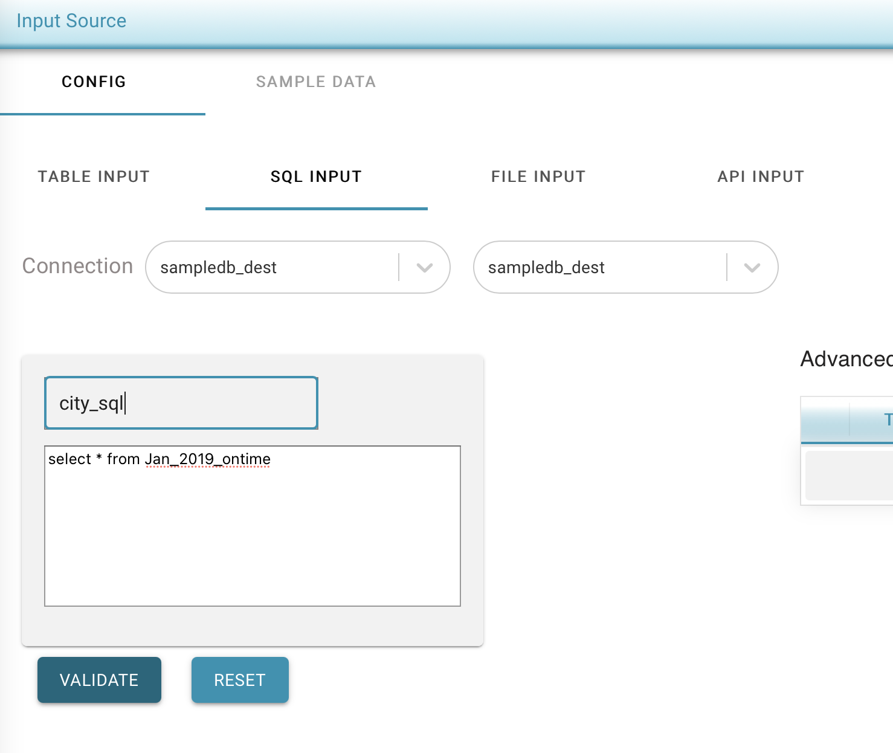

# Input SQL Data

To provide one or more SQL/s 

* Select the Connection Name from the drop down
* Select the schema
* Provide the sql and a name \(the name should not have spacess\)
* Click on validate
* If the sql is valid, the sql is added on the right side list.

