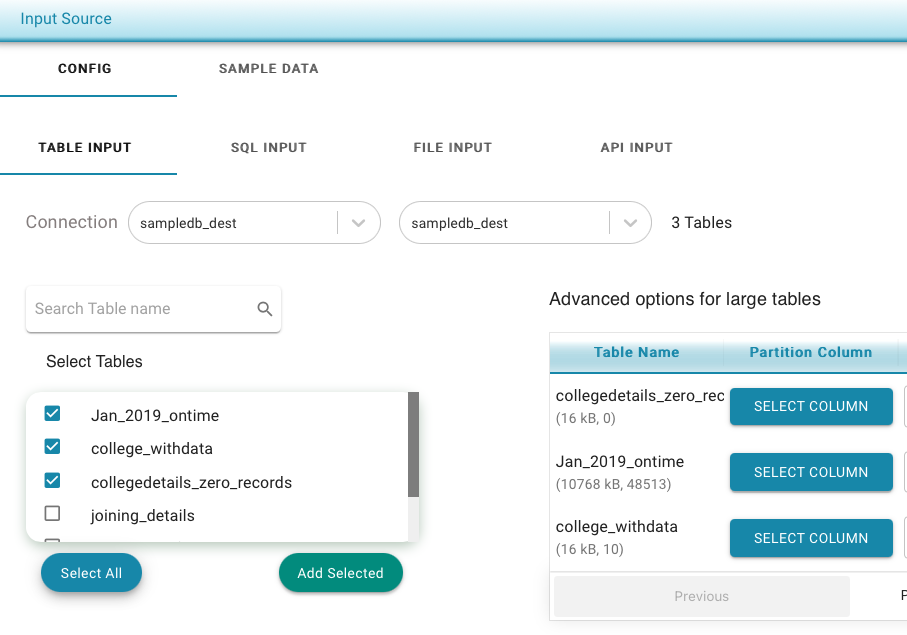

# Configure Table/s from Database

To select one or more tables :

* Select the Connection Name from the drop down
* Select the schema
* Select the checkbox for all the tables that need to be validated
* Click on "Add selected" at the bottom 

**Advanced Options** : For large tables, it is recommended to provide partition column so TestingWhizPro can pull the data in parallel. 

TestingWhizPro can autodetect the partition column however it is recomended for user to provide this.

**Rules for selecting the partition column :**

* The column should have index.
* The column should be numeric or date column.
* If the columm is string type, ensure the bucket size is not too low for a distinct value.
  * Example : If you have to choose between city and person\_name, select city as partition column as the person\_name is highly unique.

If the column is of type 

