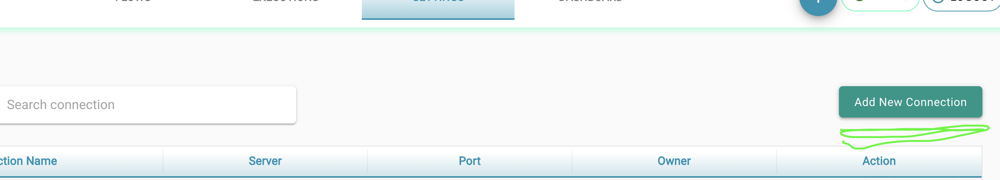
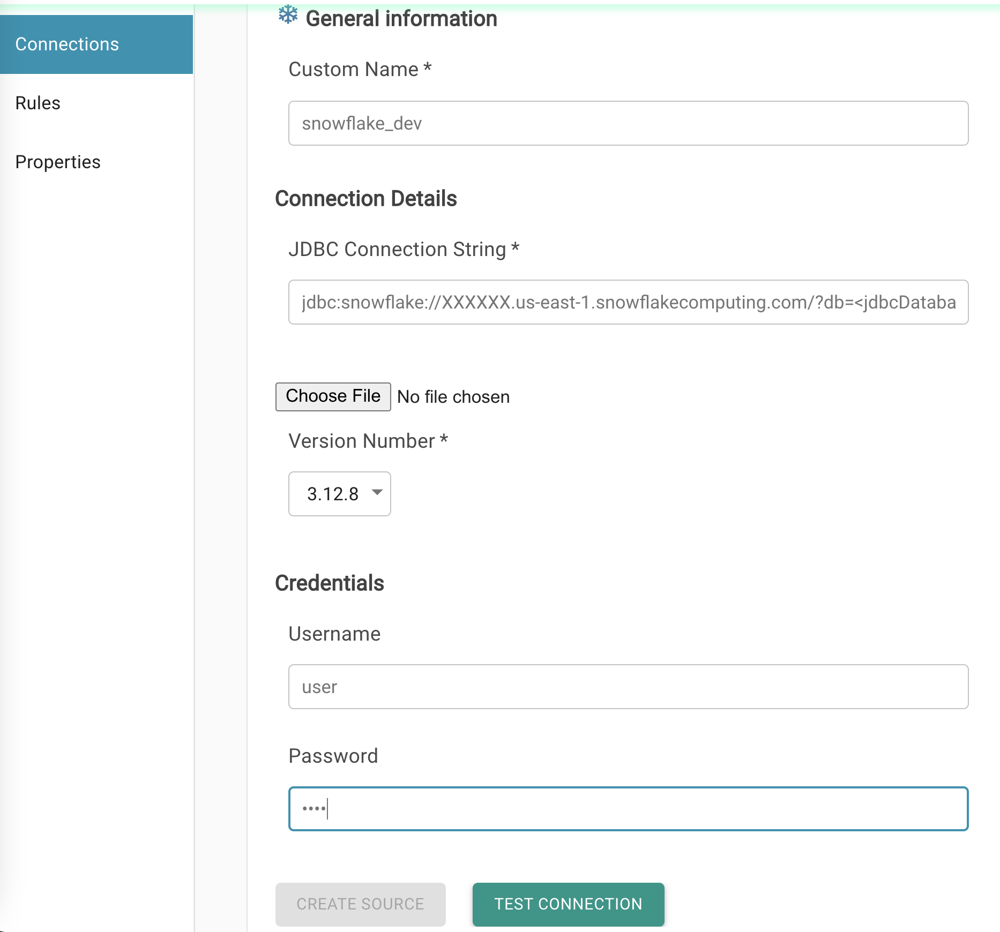

# Create Data Connections

Data connections are used as a link to a database (DB) to retrieve data for test cases. To add a new DB connection:

* Click on the _Settings tab_ from the top menu.

* Click on the _Add New Connection_ button.

* Select the type of DB from the shown options to use as data source.
*   Provide the required details for the connection, such as:

    * **Connection Name : ** This name is used to connect to this data source.
    * **JDBC Connection String : **JDBC Connection URL.
    * **User : **User Name.
    * **Password : **Password.

* Click on _Test Connection_ and then _Create Source_ when the connection's details have been validated.

