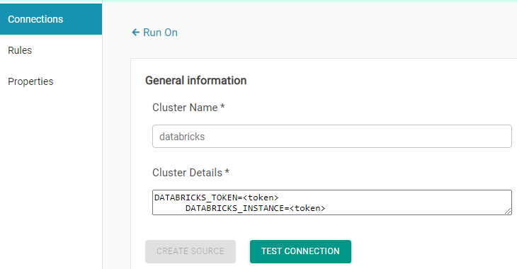

# Run On

You can also add connections that run on Hadoop Cluster and Databricks.

## Hadoop Cluster 

_Upcoming section_

## AWS EMR Cluster On Demand

* Add a _Hadoop Cluster _connection.
* Click on the _On Demand Cluster_ box on the top-right corner.
* Type a connection name, which you will assign to this connection for internal use.
* Provide the details as shown below

Configuring with On Demand Cluster enables jobs to leverage EMR cluster on demand. EMR cluster is launched on the fly and terminated on completing the job.

* AWS_EMR_SERVICE_ROLE=EMR_DefaultRole  ([Service role for Amazon EMR](https://docs.aws.amazon.com/emr/latest/ManagementGuide/emr-iam-role.html))
* AWS_EMR_EC2\_SERVICE_ROLE=EMR_EC2\_DefaultRole  ([Service Role for Cluster EC2 Instances](https://docs.amazonaws.cn/en_us/emr/latest/ManagementGuide/emr-iam-role-for-ec2.html) )
* AWS_REGION=us-east-1 (Region) 
* AWS_SERVICE_NAME=elasticmapreduce 
* AWS_EMR_CLUSTER_TAGS=Name:XYZ,Project:TestingWhizPro AWS_NETWORK_VPC=vpc-vpcid 
* AWS_EMR_CLUSTER_APPLICATION_NAMES=Spark,Livy,Hive
* AWS_EMR_RELEASE_LABEL=emr-5.31.0
* AWS_EMR_CLUSTER_CREATE_JOBNAME=EMRSparkCluster 
* AWS_EMR_S3\_LOG_URI=s3://aws-logs-XYZ-us-east-1/elasticmapreduce/
* AWS_EC2\_INSTANCE_SUBNET=subnet-XYZ (private subnet id where emr cluster is launched)
* AWS_EMR_EC2\_MASTER_INSTANCE_TYPE=m5.2xlarge
* AWS_EMR_EC2\_SLAVE_INSTANCE_TYPE=m5.2xlarge 
* AWS_NETWORK_VPC=vpc-XYZ (VPC id)

## Databricks

There are primarily two ways Databricks can be used.

* Existing Databricks cluster.
* Launch on demand cluster and terminate on completing the job. 

To add a Databricks Cluster as a connection:

* Type a connection name, which you will assign to this connection for internal use.
* Provide cluster details, as shown below.

> DATABRICKS_TOKEN=\<token>
>
> DATABRICKS_INSTANCE=\<XXXXXXXXXXXXXX.cloud.databricks.com>

