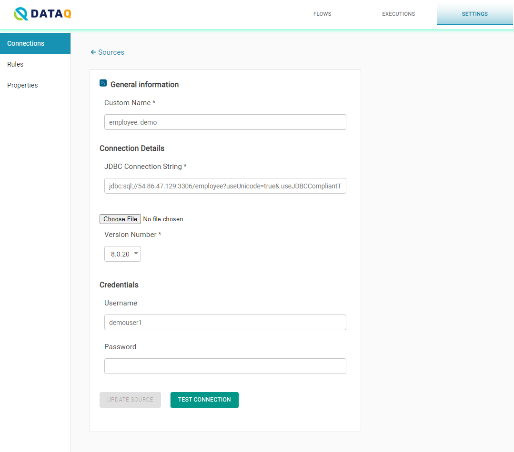
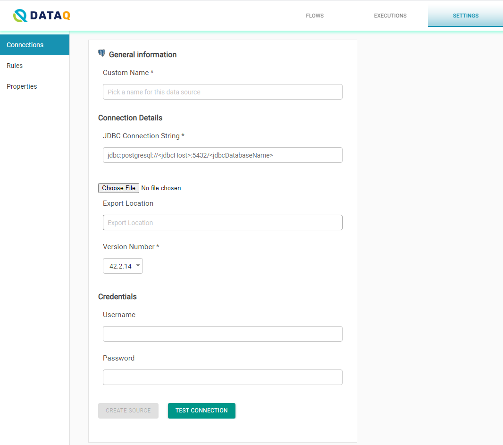

# Databases/Warehouses

Some of the databases and warehouse available when clicking on _Add New Connection_ might require more information than the one shown in the previous section, or could have extra options.

## Redshift

To add a Redshift connection, you will have to provide:

* Connection name, which you will assign to this connection for internal use.
* A JDBC URL. A sample JDBC URL is shown under this text.

> jdbc:redshift://redshift-cluster-1.XXXXXXXXXX.us-east-1.redshift.amazonaws.com:5439/dev?ssl=false

* Credentials, which will be a username and a password that will provide access to this database. 

Optionally, you may provide _s3TempDir_ and _s3AwsIamRole_ for better performance, as explained in the following link. 



> **s3TempDir**
>
> s3n://**&lt;S3\_Bucket&gt;**/
>
> **s3AwsIamRole**
>
> arn:aws:iam::**XYZ**:role/Redshift\_Role

## SQL Server

To add an SQL Server connection, you will have to provide:

* Connection name, which you will assign to this connection for internal use.
* A JDBC URL. A sample JDBC URL is shown under this text.

> jdbc:sqlserver://XXXXXX:1433;databaseName=XXXXXXX;

* Credentials, which will be a username and a password that will provide access to this database.

## Postgres

To add a PostgresSQL connection, you will have to provide:

* Connection name, which you will assign to this connection for internal use.
* A JDBC URL. A sample JDBC URL is shown under this text.

> jdbc:postgresql://&lt;jdbcHost&gt;:XXXX/&lt;jdbcDatabaseName&gt;

* Credentials, which will be a username and a password that will provide access to this database.

If SSL is enabled, additional parameters will be required for the JDBC URL as shown under this text. 

> jdbc:postgresql://&lt;jdbcHost&gt;:XXXX/&lt;jdbcDatabaseName&gt;&ssl=true**&sslmode=require&sslfactory=org.postgresql.ssl.NonValidatingFactory**

## Snowflake

To add a Snowflake connection, you will have to provide:

* Connection name, which you will assign to this connection for internal use.
* A JDBC URL. A sample JDBC URL is shown under this text.

> jdbc:snowflake://XXX72530.us-east-1.snowflakecomputing.com/?db=&lt;jdbcDatabaseName&gt;&schema=&lt;schemaName&gt;

* Credentials, which will be a username and a password that will provide access to this database.

