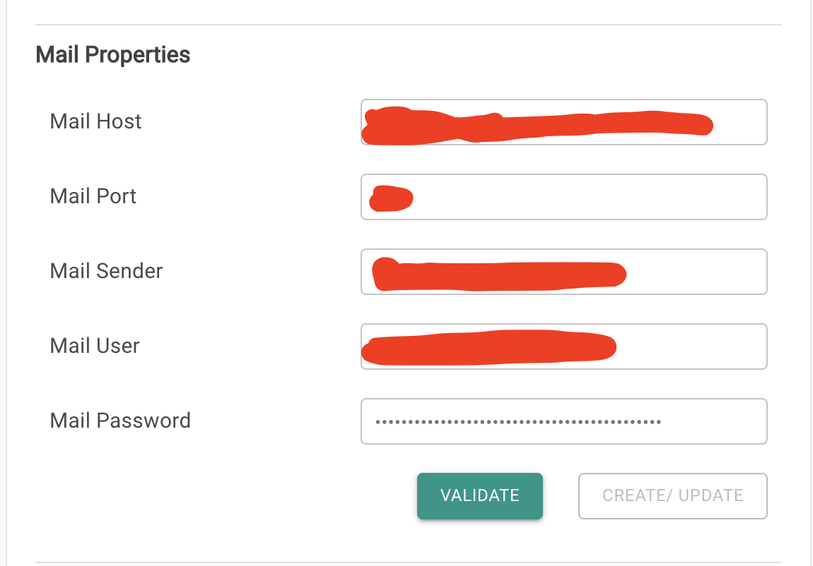
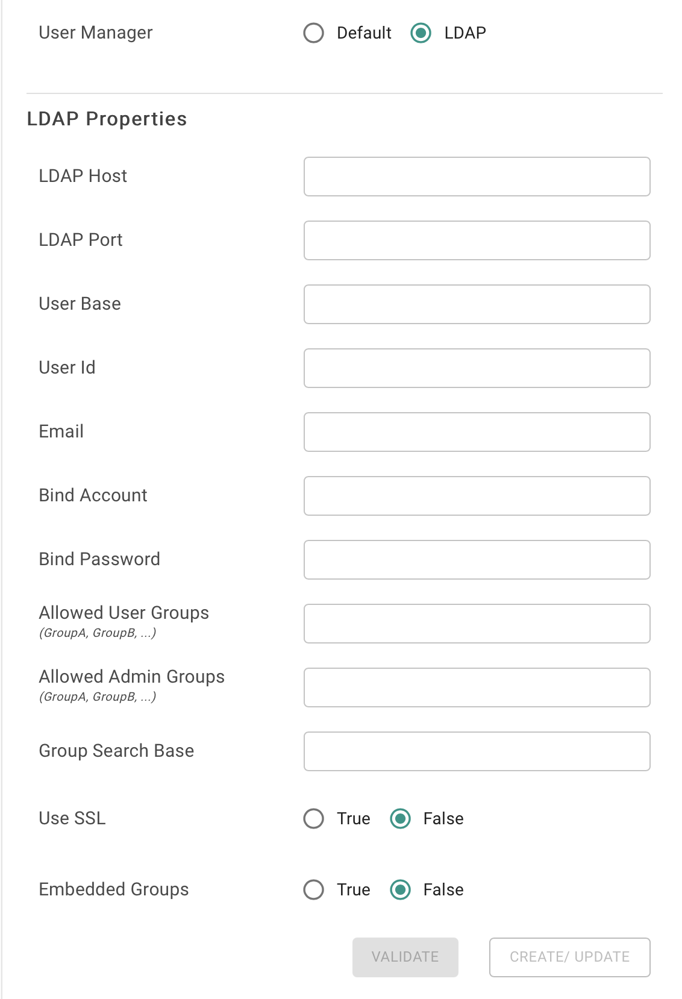

# Post Install

Go to Settings --&gt; Properties and fill up the details. 

## To setup Email Server

Provide the following properties

## To setup Server Default Time Zone

Select the drop down from "Default Timezone"

## To setup LDAP

1. Select LDAP in "User Manager" and fill up the details 
2. Restart the server using ./restart\_server.sh for the LDAP changes to take effect.

