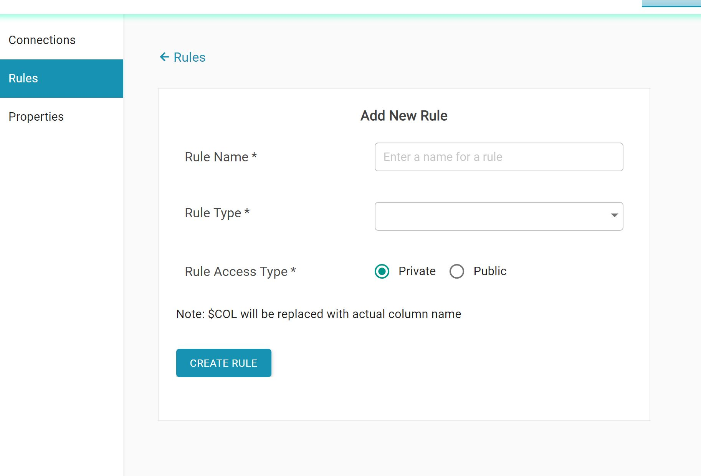

# Settings

* Settings tab is used to create connections and also to create custom validation functions.
* The connections created by a user will be visible to all users in that group to which the current user belong to.

* Rules tab shows list of all custom rules created by the user and also ability to add new rules.
* New rule can be created by clicking on Add new rule. Rules defined here can be used at column level in SQL rules tab in Data Quality component

* Rule type can be a regular expression or a SQL where condition. 

