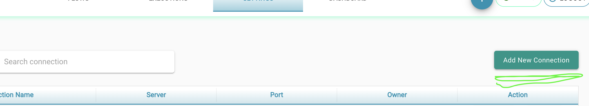
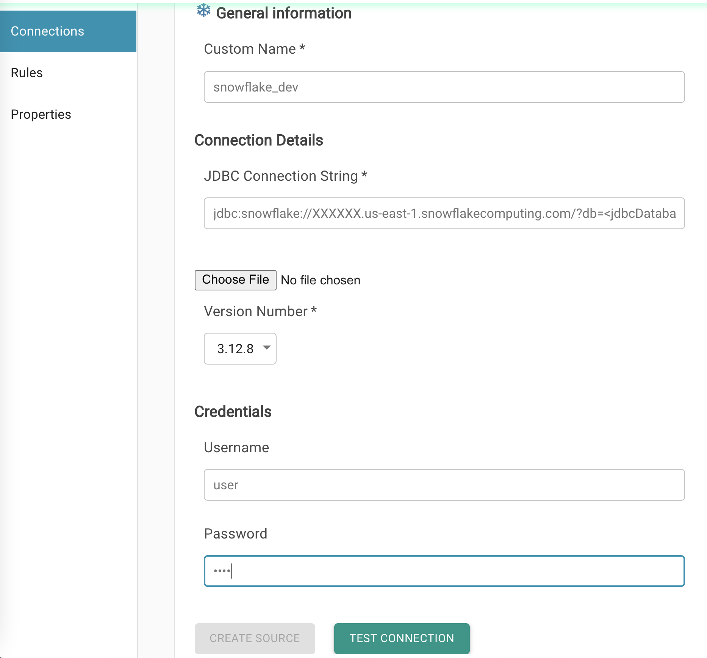
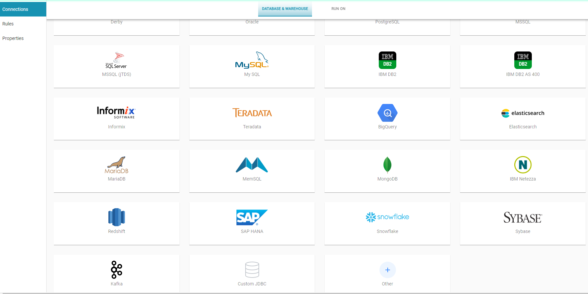

# Create Data Connections

To add a new DB connection

* Click on **Settings** from the top menu

* Click on "**Add New Connection**" button 

* Select the Data Source that you want to configure
* Provide details for the connection

  * **Connection Name :**  This name is used to connect to this data source
  * **JDBC Connection String :** JDBC Connection URL
  * **User :** User Name
  * **Password :** Password

* Click on Test connection and Create Source when connection is valid.

Note : If the DB you are looking is not available and the DB has the JDBC driver, select "other" at the bottom and upload the JDBC driver and the URL.

