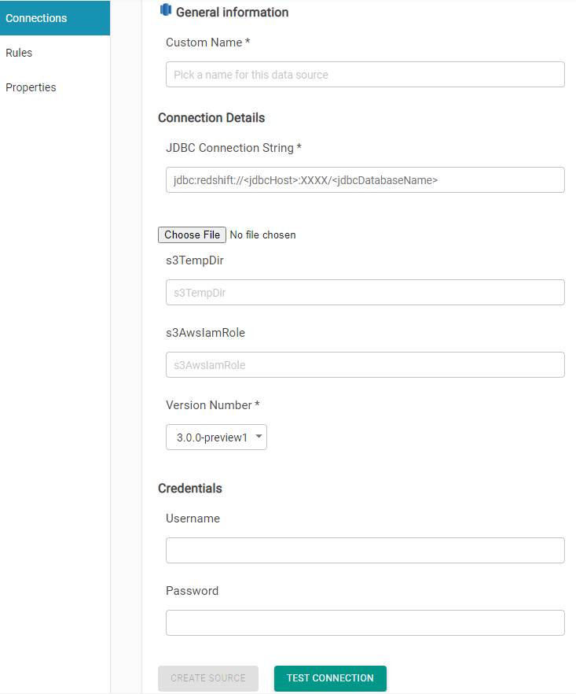

# Redshift

Provide connection Name \(The name has to be 

Provide JDBC URL, User name and password

> Sample JDBC URL
>
> jdbc:redshift://redshift-cluster-1.XXXXXXXXXX.us-east-1.redshift.amazonaws.com:5439/dev?ssl=false

Optionally provide **s3TempDir** and **s3AwsIamRole** for better performance. 

> **s3TempDir**
>
> s3n://**&lt;S3\_Bucket&gt;**/
>
> **s3AwsIamRole**
>
> arn:aws:iam::**XYZ**:role/Redshift\_Role

