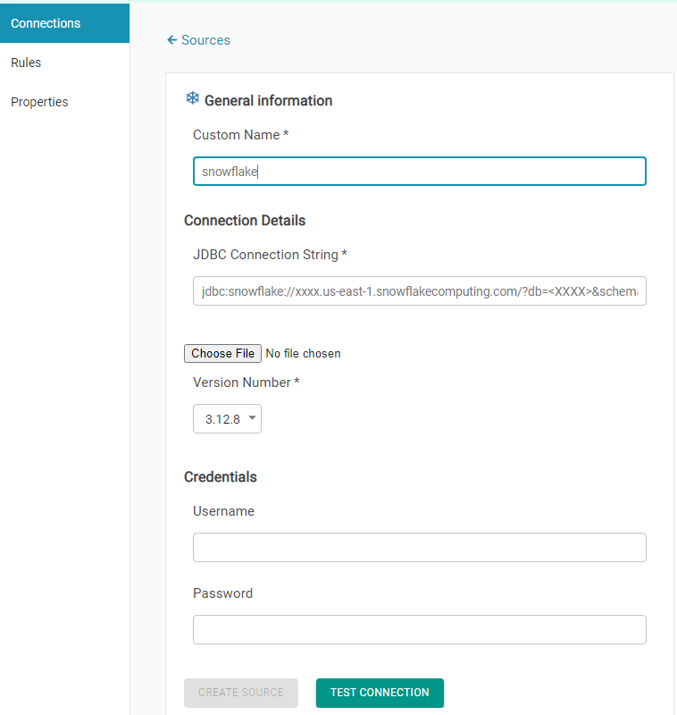

# Snowflake

Provide Connection Name 

Provide Cluster Details

> Sample JDBC URL, User name and password
>
> jdbc:snowflake://XXX72530.us-east-1.snowflakecomputing.com/?
>
> db=&lt;jdbcDatabaseName&gt;&schema=&lt;schemaName&gt;

