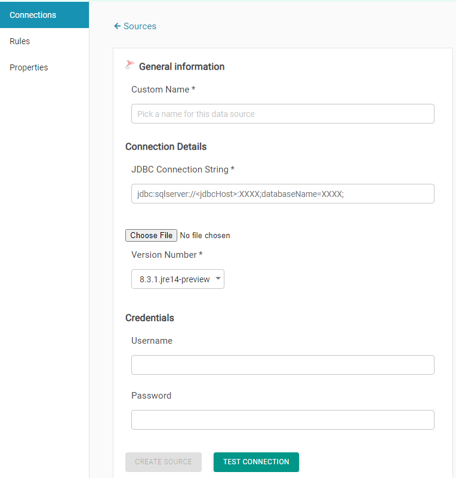

# SQL Server

Provide Connection Name 

Provide JDBC URL, User name and Password

> Sample JDBC URL
>
> jdbc:sqlserver://XXXXXX:1433;databaseName=XXXXXXX;

Validate the connection by clicking on **TEST CONNECTION** and then **CREATE SOURCE**

